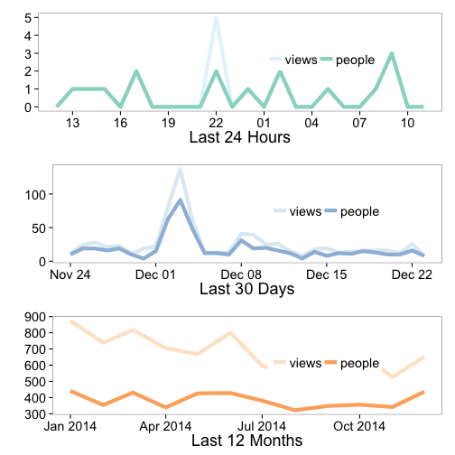

rgauges
=======

__NOTE: This package has been ORPHANED on CRAN - you can still install it from here and from CRAN manually, but we're no longer supporting this package__

`rgauges` is an R wrapper to the gaug.es API for website analytics.

## Gaug.es API docs

See the Gaug.es API documentation here [http://get.gaug.es/documentation/](http://get.gaug.es/documentation/)

`rgauges` is listed as one of the Gaug.es API libraries [here](http://get.gaug.es/documentation/api/libraries/), along with libraries for Ruby and Node.js

## Authentication

Get your own API key in your Gaug.es 'My Account' page and put in your .Rprofile file under the name 'GaugesKey' or some other name (you can specify `keyname` in function calls - but if you put in as 'GaugesKey' you're all set and don't need to bother with the `keyname` parameter).

## Installation

Stable-r version from CRAN


```r
install.packages("rgauges")
```

Development version from Github


```r
install.packages("devtools")
devtools::install_github("ropensci/rgauges")
```

Load the package


```r
library("rgauges")
```

## Your info


```r
gs_me()
#> $user
#> $user$id
#> [1] "4eddbafb613f5d5139000001"
#> 
#> $user$email
#> [1] "myrmecocystus@gmail.com"
#> 
#> $user$name
#> [1] "Scott Chamberlain"
#> 
#> $user$first_name
#> [1] "Scott"
#> 
#> $user$last_name
#> [1] "Chamberlain"
#> 
#> $user$urls
#> $user$urls$self
#> [1] "https://secure.gaug.es/me"
#> 
#> $user$urls$gauges
#> [1] "https://secure.gaug.es/gauges"
#> 
#> $user$urls$clients
#> [1] "https://secure.gaug.es/clients"
```

### Traffic


```r
gs_traffic(id='4efd83a6f5a1f5158a000004')
```


```
#> [[1]]
#> [[1]]$date
#> [1] "2014-12-01"
#> 
#> [[1]]$views
#> [1] 22
#> 
#> [[1]]$people
#> [1] 15
#> 
#> 
#> [[2]]
#> [[2]]$date
#> [1] "2014-12-02"
#> 
#> [[2]]$views
#> [1] 81
#> 
#> [[2]]$people
#> [1] 63
#> 
#> 
#> [[3]]
#> [[3]]$date
#> [1] "2014-12-03"
#> 
#> [[3]]$views
#> [1] 137
#> 
#> [[3]]$people
#> [1] 91
```

## Screen/browser information


```r
gs_reso(id='4efd83a6f5a1f5158a000004')
#> $browser_height
#>   title views
#> 1   600   278
#> 2   480   144
#> 3   768   106
#> 4   900    81
#> 5  1024    43
#> 
#> $browser_width
#>   title views
#> 1  1280   165
#> 2   320   135
#> 3  1024   118
#> 4  1600   105
#> 5  1440    66
#> 6   800    41
#> 7   480    17
#> 8  2000     5
#> 
#> $screen_width
#>   title views
#> 1  1280   259
#> 2  1600   150
#> 3  1440    71
#> 4   320    69
#> 5  1024    50
#> 6   480    29
#> 7  2000    23
#> 8   800     1
```

## Visualize traffic data

You'll need to load ggplot2


```r
library("ggplot2")
out <- gs_gauge_detail(id='4efd83a6f5a1f5158a000004')
invisible(vis_gauge(out))
```

 

## Meta

* Please [report any issues or bugs](https://github.com/ropensci/rgauges/issues).
* License: MIT
* Get citation information for `rgauges` in R doing `citation(package = 'rgauges')`

[](http://ropensci.org)
